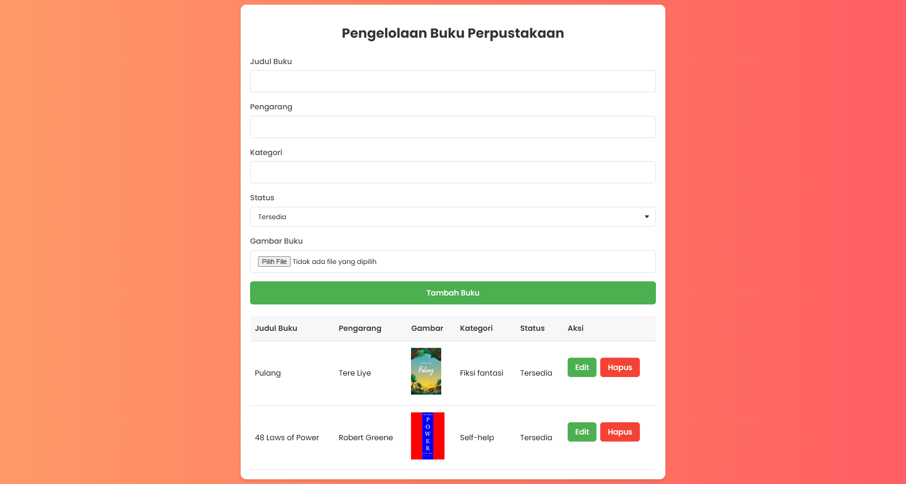

# Aplikasi Pengelolaan Buku Perpustakaan

Aplikasi ini digunakan untuk mengelola data buku di perpustakaan, dibangun menggunakan PHP, HTML, CSS, dan SQLite.

## Fitur

- Tambah data buku baru
- Edit data buku
- Hapus data buku
- Pencarian buku berdasarkan judul atau penulis
- Penyimpanan data menggunakan database SQLite

## Persyaratan

Pastikan server Anda sudah memiliki:
- PHP 7.x atau lebih tinggi
- SQLite

## Instalasi

1. Clone repositori atau unduh file zip.
2. Pastikan Anda memiliki server lokal seperti XAMPP atau LAMP.
3. Letakkan file ini dalam direktori server lokal Anda (misal: `htdocs` di XAMPP).
4. Jalankan server lokal Anda.

## Penggunaan

1. Buka browser Anda dan arahkan ke alamat `localhost/nama-folder`.
2. Aplikasi akan otomatis membuat database SQLite jika belum ada.
3. Gunakan antarmuka untuk menambah, mengedit, atau menghapus data buku.

